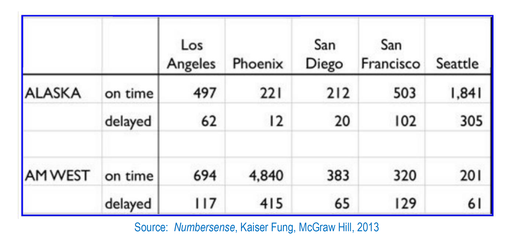

```{r setup, include=FALSE}
knitr::opts_chunk$set(echo = TRUE)
```

```{r figurename, echo=FALSE, fig.cap="", out.width = '80%'}

```

##### **Overview**

Given above table we can see different Airlines, City and the count of flight ontime and delayed. 
Analysis below shows, total number of flight delays between Airlines, Total number of flight delays 
between cities and the delay ratio between different city.

[Note: Flight Delay percent = (Number of flight delayed / Total number of flight) * 100

Flight ontime percent = (Number of flight ontime / Total number of flight) * 100]

Loaded table in 2 ways. 

1. Using "insert_table" method
2. After laoding table, export table data to csv file and read that file using read.csv().


##### Installed required packages and loaded libraries

```{r eval=TRUE}
#devtools::install_github("lbusett/insert_table")
#install.packages("tidyr")
#install.packages("dplyr")
#install.packages("ggplot2")
library(tidyr)
library(dplyr)
library(ggplot2)
library(knitr)
library(inserttable)

```

##### Creat Table using inserttable method 

```{r}
#insert_table(tbl_name = "Flights", nrows = 4, ncols = 4, tbl_format = "DT")
Flights <- tibble::tribble(
  ~AirLines,   ~Status, ~LosAngeles, ~Phoenix, ~SanDeigo, ~SanFrancisco, ~Seattle,
   "ALASKA",  "ontime",       "497",    "221",     "212",         "503",   "1841",
         NA, "delayed",        "62",     "12",      "20",         "102",    "305",
         NA,        NA,          NA,       NA,        NA,            NA,       NA,
   "AMWEST",  "ontime",       "694",   "4840",     "383",         "320",    "201",
         NA, "delayed",       "117",    "415",      "65",         "129",     "61"
  )

require(knitr)
kable(Flights, digits = 3, row.names = FALSE, align = "c",
              caption = NULL)

Flights <- as.data.frame(Flights)
Flights

#Export to csv file
write.csv(Flights, file = "FlightsTable.csv")

#Read csv file
Flights <- read.csv("FlightsTable.csv")
Flights
```

```{r}
#Replace 'NA' with correspond Airlines
Flights$AirLines[2] <- c("ALASKA")
Flights$AirLines[5] <- c("AMWEST")

# Remove NA row from the data
Flights <- Flights %>% filter(!is.na(Flights$Status))
Flights

#Convert differnt city name to column "City"
Flights_new <- Flights  %>% select(AirLines,Status,LosAngeles,Phoenix,SanDeigo,SanFrancisco,Seattle) %>% gather(City,Flight_Count,3:7)
Flights_new

#Convert "Status" Column to row
Flights_new <- Flights_new  %>% mutate_if(is.factor, as.character)
#Flights_new <- tibble::rowid_to_column(Flights_new)
Flights_new

Flights_new <- Flights_new %>% spread(Status,Flight_Count)
Flights_new
```

```{r}
#Analysis: graph shows Different Airline delayed flight count
delay_airline <- Flights_new  %>%  select(AirLines,delayed,ontime) 
delay_airline <- delay_airline %>% group_by(AirLines) %>% summarise(Total_delay_Flight = sum(delayed))
delay_airline
ggplot(delay_airline, aes(x = delay_airline$AirLines, y = delay_airline$Total_delay_Flight)) + geom_bar(stat="identity",position="dodge", color = "blue", fill="#72a555") + xlab("Airlines") + ylab("Number of flight delayed")  +   ggtitle("Total delayed flights by airlines") + theme(plot.title = element_text(hjust = 0.5)) + geom_text(aes(label=delay_airline$Total_delay_Flight), vjust=1.6, color="white",position = position_dodge(0.9), size=4.5)
```


##### Analysis: Different cities delayed flight count

```{r}
delay_city_flight <- Flights_new  %>%  select(AirLines,City,delayed) 
delay_city_flight <- delay_city_flight %>% group_by(AirLines,City) %>% summarise(Total_delay_Flight = sum(delayed))
delay_city_flight
ggplot(data = delay_city_flight, aes(x = delay_city_flight$City, y = delay_city_flight$Total_delay_Flight,fill = delay_city_flight$AirLines)) + geom_bar(stat = "identity", position=position_dodge()) + geom_text(aes(label=delay_city_flight$Total_delay_Flight), vjust=1.6, color="white",position = position_dodge(0.9), size=4.5)+scale_fill_manual(values=c("#638ccc", "#72a555"))+ xlab("City") + ylab("Number of flights delayed by city")  + ggtitle("Airlines wise delayed flight count by Cities") + theme(plot.title = element_text(hjust = 0.5))+labs(fill = "Airlines")
```

#####  Analysis: Flight Delay percent by different cities
```{r}
delay_percent <- Flights_new %>% select(AirLines,City,ontime,delayed) %>% group_by(AirLines,City) %>% mutate(total_flight = sum(ontime,delayed)) 
delay_percent <- delay_percent %>% group_by(AirLines,City) %>% mutate(percent = as.integer(round(delayed/total_flight * 100,0)))
delay_percent
ggplot(data = delay_percent, aes(x = delay_percent$City, y = delay_percent$percent, fill = delay_percent$AirLines)) + geom_bar(stat = "identity", position=position_dodge()) + geom_text(aes(label=delay_percent$percent), vjust=1.6, color="white",position = position_dodge(0.9), size=4.5) +scale_fill_manual(values=c("#c57c3c", "#488A99"))+xlab("City") + ylab("Delayed fight percent (%)")  + ggtitle("Airlines wise delayed flight percent by Cities") + theme(plot.title = element_text(hjust = 0.5))+labs(fill = "Airlines")
```

#####  Analysis: Flight ontime percent by different cities
```{r}
ontime_percent <- Flights_new %>% select(AirLines,City,ontime,delayed) %>% group_by(AirLines,City) %>% mutate(total_flight = sum(ontime,delayed)) 
ontime_percent <- ontime_percent %>% group_by(AirLines,City) %>% mutate(percent_ontime = as.integer(round(ontime/total_flight * 100,0)))
ontime_percent
ggplot(data = ontime_percent, aes(x = ontime_percent$City, y = ontime_percent$percent_ontime, fill = delay_percent$AirLines)) + geom_bar(stat = "identity", position=position_dodge()) + geom_text(aes(label=ontime_percent$percent_ontime), vjust=1.6, color="white",position = position_dodge(0.9), size=4.5) +scale_fill_manual(values=c("#c57c3c", "#488A99"))+xlab("City") + ylab("Ontime fight percent (%)")  + ggtitle("Airlines wise Ontime flight percent by Cities") + theme(plot.title = element_text(hjust = 0.5))+labs(fill = "Airlines")
```

##### Conclusion

From the above graph we can see, 

* Phoenix city has more ontime flight percent and 
less delayed flight percent. 
* SanFrancisco has less ontime percent and more delayed 
percent. 
* AMWEST has more delay flights than Alaska.


